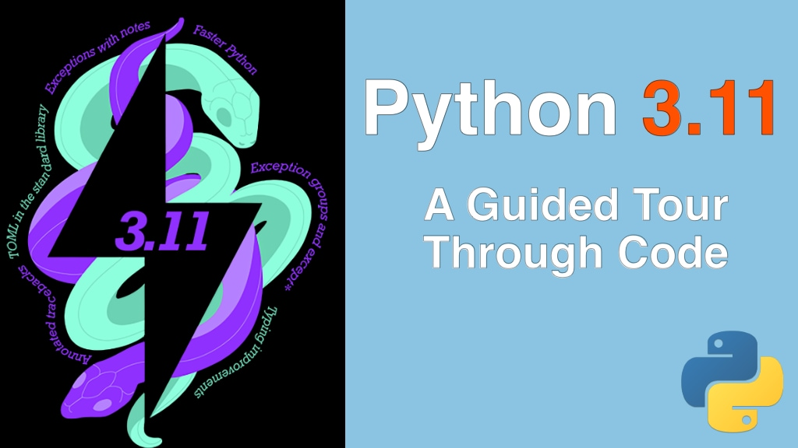

# Python 3.11: A Guided Tour Through Code

Student materials and handouts for our [Python 3.11: A Guided Tour Through Code](https://training.talkpython.fm/courses/python-3.11-a-guided-tour-through-code) course

## Course Summary

Python 3.11 is one of the most significant releases in years. It's also one of the biggest 
with the change log weighing in at over 175,000 words of updates. You may have seen the headline features. 
But have you had a chance to explore them with code and really see how they can make your apps better? 
This 2-hour course is your guided tour of the changes to Python with this important release.

See the [course page](https://training.talkpython.fm/courses/python-3.11-a-guided-tour-through-code) 
for all the details and to sign up.
